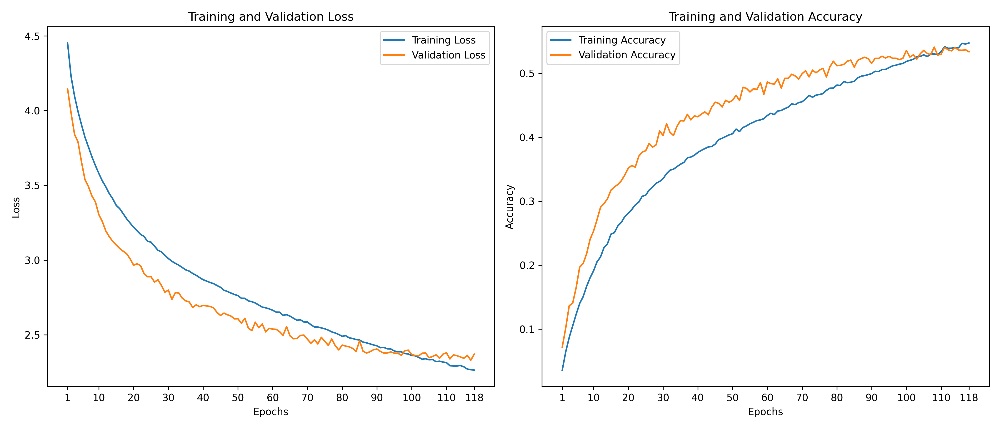

# Places-ResNet

My experiment training a ResNet-inspired model for image classification using PyTorch.

**Key terms: distributed training, residual layers, convolutional layers, batch normalization, dropout, pooling, SGD, label smoothing, learning rate scheduling, early stopping, data augmentation.**

Training time was approximately 10 hours (108 epochs) using **distributed training** across university server GPUs.

## Dataset:

**MIT MiniPlaces Dataset:** Contains 100,000 training images, 10,000 validation images, and 10,000 testing images across 100 scene categories. Each image is 128x128 pixels.

## Model:

I implemented a 13-layer ResNet-inspired model for image classification. The architecture consists of:
- Initial **convolutional layer** with 64 filters, followed by **batch normalization, max pooling, and dropout**
- 3 stages of **residual blocks**, each with 4 convolutional layers
- Each **residual block** has two 3x3 **convolutional layers** with **batch normalization and dropout**
- The number of filters increases from 64 in the first stage, to 128, 256, and 512 in the later stages
- **Global average pooling and dropout** before a final **fully connected layer**

The total number of trainable model parameters is 29,678,180.

## Training:

The training setup used a **distributed training** approach, with **early stopping** to prevent overfitting. **Data augmentation** techniques were applied to the training and validation sets. An **SGD optimizer** with **label smoothing** was used, along with a **ReduceLROnPlateau learning rate scheduler**.

## Performance:

Best model checkpoint results (epoch 108):

- Training Loss: 2.3231, Training Accuracy: 53.02%
- Validation Loss: 2.3426, Validation Accuracy: 54.09%
- Top-5 Validation Accuracy: 81.34%

Achieving a **Top-1 accuracy of 54.09% and Top-5 accuracy of 81.34%**

